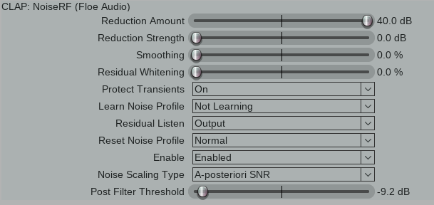

# NoiseRF

_GUI in Reaper (it will vary between hosts)_

## Noise Repellent Fork - CLAP plugin

This is a fork of Luciano Dato's noise reduction library [libspecbleach](https://github.com/lucianodato/libspecbleach) and LV2 plugin, [noise-repellent](https://github.com/lucianodato/noise-repellent).

It's licensed under LGPLv3.

As of writing this (April 2024), the original version is not maintained, and has tricky dependencies for compiling on all 3 OS. This version differs from the original library and plugin in the following ways:
- It is a CLAP plugin instead of LV2 (still supports Linux, macOS, and Windows)
- Exposes a few more parameters in the plugin
- It uses pffft instead of fftw3
- It uses Zig for the build system allowing for simple compilation across all platforms
- There is no adaptive mode
- Adds support for loading noise profiles that have a different sample rate than the audio being processed (often happens when rendering out of a DAW).
- It fixes state saving ([issue](https://github.com/lucianodato/noise-repellent/issues/114))
- It fixes input latency ([issue1](https://github.com/lucianodato/libspecbleach/issues/56), [issue2](https://github.com/lucianodato/noise-repellent/issues/116))
- The library code (libspecbleach) and plugin code (noise-repellent) are in a single repository - this was just done for convenience

## Installation
Download the appropriate binary for your OS from the 'Releases' section of the GitHub. Unzip it and place the plugin in your CLAP directory:

Linux: `~/.clap` or `/usr/lib/clap`.

Windows: `C:\Program Files\Common Files\CLAP` or `%LOCALAPPDATA%\Programs\Common\CLAP`

MacOS: `/Library/Audio/Plug-Ins/CLAP` or `~/Library/Audio/Plug-Ins/CLAP`

There's both ARM and Intel versions for macOS. They are codesigned and notarized.

## Notes
I have found this algorithm can produce very high quality results - equivalent to Waves Z-Noise or iZotope RX Spectral De-noise for my use cases. It doesn't have the fancy GUI that those plugins have but still has a very usable interface and high quality processing.

For best results, set your project sample rate to the rate that you want to render at. It's better to acquire the noise profile at the same sample rate that is being processed otherwise an interpolation algorithm is used which might subtly affect the results.

## Building
Zig 0.13.0 is required. Cross-compiling is easy: `zig build -Dtarget=x86_64-linux`, `zig build -Dtarget=x86_64-windows`, `zig build -Dtarget=aarch64-macos`. Binaries are placed in `zig-out` folder. See `zig build --help` for more options.

## Dependencies
We've removed the fftw3 dependency, so only glibc is needed on Linux.

## Usage
See the original wiki: https://github.com/lucianodato/noise-repellent/wiki
